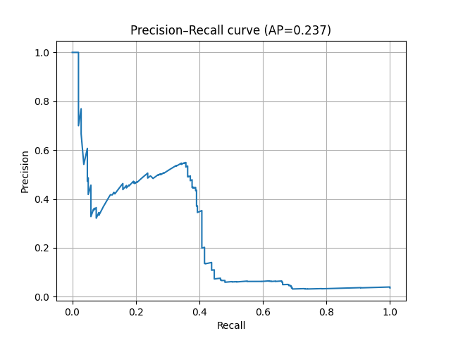
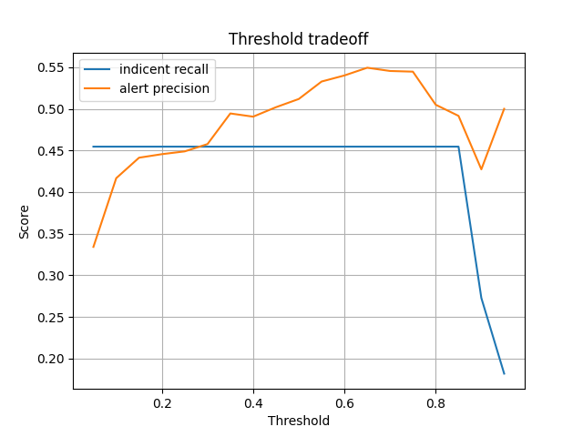
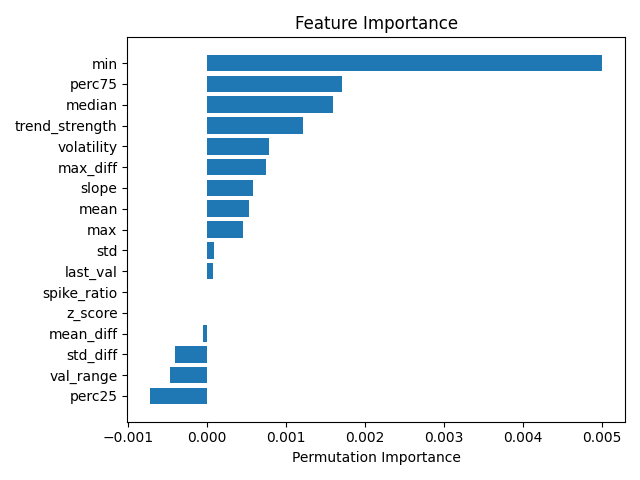

# Predictive Alerting for Cloud Metrics

## Overview

Modern cloud systems are monitored using thousands of time-series metrics. When a service begins to degrade, these metrics often exhibit **early warning signals** before the actual incident occurs. The goal of this project is to build a **predictive alerting system** that can detect these signals and trigger alerts *before* an incident starts.

This repository implements a complete machine learning pipeline that:

1. Converts raw time-series metrics into sliding-window statistical features  
2. Trains a machine learning model to recognize patterns that precede incidents  
3. Evaluates predictions using **incident-aware metrics**  
4. Visualizes model behavior using diagnostic plots

---

# Problem Formulation

We observe a time series of a system metric:

```

TimeStamp, Value

```

Additionally, the dataset contains expert annotations indicating when incidents occur:

```

Label = 1 → incident period
Label = 0 → normal operation

```

Instead of detecting incidents when they happen, the objective is to **predict whether an incident will occur soon**.

The problem is formulated as a binary classification task:

> Given the last **W time steps**, predict whether an incident will start within the next **H time steps**.

Where:

| Parameter | Meaning |
|---|---|
| **W** | sliding window length (history used for features) |
| **H** | prediction horizon (future window where incident may occur) |

Example configuration used in experiments:

```

W = 90
H = 30

```

This means:

- the model observes the **last 90 measurements**
- it predicts whether an incident will occur within the **next 30 steps**

---

The system focuses purely on **early warning signals**.

During feature generation:

- windows that **end during an incident are removed**
- the model only learns from **normal system behavior before incidents**

This prevents the model from learning trivial patterns from ongoing incidents and forces it to learn **precursors of failures**.

---

# Project Pipeline

The full workflow is composed of four steps.

```

Raw Time Series
│
▼
Sliding Window Feature Extraction
│
▼
Machine Learning Model Training
│
▼
Incident-aware Evaluation
│
▼
Diagnostic Visualizations

````

---

# Quick Start

Clone the repository and install dependencies.

```bash
git clone https://github.com/JanBurda03/PredictiveAlerting
cd PredictiveAlerting

python -m venv venv
source venv/bin/activate   # Windows: venv\Scripts\activate

pip install -r requirements.txt
```

# Running the Pipeline

## 1 Feature Extraction

The first step converts the raw time-series dataset into **sliding-window feature vectors**.

Each training sample is created from:

- the previous **W measurements** (history window)
- a label indicating whether an incident occurs within the next **H steps** (prediction horizon)

Example command:

```bash
python src/feature_extraction.py \
    --input_file data/raw/dataset.csv \
    --W 90 \
    --H 30 \
    --output_dir data/processed \
    --split \
    --test_size 0.5
```

### Parameters

| Parameter      | Description                                                              |
| -------------- | ------------------------------------------------------------------------ |
| `--input_file` | Path to the raw dataset                                                  |
| `--W`          | Sliding window size (number of past measurements used as features)       |
| `--H`          | Prediction horizon (how many future steps we look ahead for an incident) |
| `--output_dir` | Directory where the processed dataset will be saved                      |
| `--split`      | If enabled, the dataset is split into training and testing sets          |
| `--test_size`  | Fraction of the dataset used for testing (only used with `--split`)      |

### Output

If `--split` is enabled:

```
data/processed/train.csv
data/processed/test.csv
```

The split is performed **chronologically (`shuffle=False`)** to prevent time-series data leakage.

If `--split` is not used, a single dataset file is generated:

```
data/processed/dataset.csv
```

## 2 Train the Model

```bash
python src/train_model.py \
    --dataset data/processed/train.csv \
    --save_dir models
```

Output:

```
models/model.pkl
```

The model used in this project is a **HistGradientBoostingClassifier**.

Gradient boosting models are a strong baseline for tabular datasets because they:

- perform well on structured features
- require minimal preprocessing
- capture nonlinear feature interactions
- train efficiently thanks to histogram-based splitting

## 3 Model Evaluation

The evaluation script supports **two evaluation modes**:

1. **Single threshold evaluation** – evaluate the model at one chosen threshold  
2. **Threshold sweep** – evaluate the model across many thresholds

Both modes compute incident-based metrics and generate diagnostic plots.

---

## Single Threshold Evaluation

Run evaluation with a fixed probability threshold:

```bash
python src/evaluate.py \
    --dataset data/processed/test.csv \
    --model models/model.pkl \
    --threshold 0.4 \
    --save_dir results
```

This evaluates the model using **one decision threshold** for converting probabilities into alerts.

---

## Threshold Sweep 

The second mode evaluates the model across **many thresholds automatically**.

```bash
python src/evaluate.py \
    --dataset data/processed/test.csv \
    --model models/model.pkl \
    --threshold_sweep \
    --thresholds 0.05 0.95 19 \
    --save_dir results
```

The parameter

```bash
--thresholds start stop num
```

is used to generate thresholds using `numpy.linspace`. Example: `0.05 0.95 19` creates **19 evenly spaced thresholds** between 0.05 and 0.95.

This allows analyzing the trade-off between **alert precision** and **incident recall**, helping pick an operational threshold.

---

# Evaluation Output

Both evaluation modes print a table with the following metrics:

| Column                 | Description                                                                            |
| ---------------------- | -------------------------------------------------------------------------------------- |
| threshold              | probability threshold used to generate alerts                                          |
| alert_precision        | fraction of alerts that fall inside prediction windows (`valid_alerts / alerts_count`) |
| incident_recall        | fraction of incidents that were detected (`detected_incidents / total_incidents`)      |
| avg_detection_distance | average lead time before incident start (in steps)                                     |
| detected_incidents     | number of incidents successfully predicted                                             |
| total_incidents        | total number of incidents                                                              |
| alerts_count           | total alerts generated (TP + FP)                                                       |
| valid_alerts           | alerts inside prediction windows (TP)                                                  |
| invalid_alerts         | false alerts (FP)                                                                      |
| false_alert_rate       | false alerts per non-incident timestep (FP / non-incident steps)                       |

Example output for a threshold sweep:

```text
Experiment results:
    threshold  alert_precision  incident_recall  avg_detection_distance  detected_incidents  total_incidents  alerts_count  valid_alerts  invalid_alerts  false_alert_rate
0        0.05         0.208666              0.7               65.857143                   7               10          1754           366            1388          0.150706
1        0.10         0.282271              0.7               65.857143                   7               10          1286           363             923          0.100217
2        0.15         0.350947              0.7               64.000000                   7               10          1003           352             651          0.070684
3        0.20         0.434944              0.7               64.000000                   7               10           807           351             456          0.049511
4        0.25         0.468657              0.7               60.714286                   7               10           670           314             356          0.038654
5        0.30         0.480438              0.7               60.571429                   7               10           639           307             332          0.036048
6        0.35         0.509182              0.7               58.000000                   7               10           599           305             294          0.031922
7        0.40         0.521127              0.7               57.285714                   7               10           568           296             272          0.029533
8        0.45         0.521818              0.7               56.571429                   7               10           550           287             263          0.028556
9        0.50         0.502146              0.7               53.571429                   7               10           466           234             232          0.025190
10       0.55         0.540603              0.7               53.571429                   7               10           431           233             198          0.021498
11       0.60         0.563725              0.6               46.333333                   6               10           408           230             178          0.019327
12       0.65         0.596354              0.6               46.333333                   6               10           384           229             155          0.016830
13       0.70         0.591667              0.6               46.333333                   6               10           360           213             147          0.015961
14       0.75         0.639394              0.5               51.200000                   5               10           330           211             119          0.012921
15       0.80         0.721254              0.5               51.200000                   5               10           287           207              80          0.008686
16       0.85         0.731343              0.5               51.200000                   5               10           268           196              72          0.007818
17       0.90         0.541667              0.4               34.000000                   4               10           144            78              66          0.007166
18       0.95         0.666667              0.2               33.000000                   2               10            84            56              28          0.003040
```

---

# Generated Plots

All plots are saved to:

```text
results/
```

### Precision–Recall Curve

```
results/precision_recall_curve.png
```


Shows the relationship between **precision** and **recall** across thresholds.

### Threshold Tradeoff

```
results/threshold_tradeoff.png
```


This plot is generated **only for the threshold sweep**. It shows how:

* `incident_recall`
* `alert_precision`

change as the alert threshold varies.

### Feature Importance

```
results/feature_importance.png
```


Permutation importance reveals which features contribute most to model predictions.


# Dataset

We used the **Microsoft Cloud Monitoring Dataset**:  
https://github.com/microsoft/cloud-monitoring-dataset  

Our pipeline was tested specifically on the metric:

```

mongodb-machine-rps

```

This metric represents the **number of MongoDB requests processed per second** on a server.  

Each record contains:

| Column    | Description           |
| --------- | --------------------- |
| TimeStamp | measurement timestamp |
| Value     | metric value          |
| Label     | incident indicator    |

Where:

```

0 = normal operation
1 = incident period

```

**Note:** In our feature extraction, **rows that already belong to an incident period are excluded** to ensure the model only predicts upcoming incidents.  

---
```


# Feature Engineering

Sliding windows of length **W** are transformed into statistical features.

Generated feature columns:

| Feature        | Description                  |
| -------------- | ---------------------------- |
| mean           | window mean                  |
| std            | standard deviation           |
| min            | minimum                      |
| max            | maximum                      |
| median         | median                       |
| perc25         | 25th percentile              |
| perc75         | 75th percentile              |
| val_range      | max − min                    |
| slope          | linear trend slope           |
| trend_strength | slope normalized by mean     |
| mean_diff      | mean of first differences    |
| std_diff       | std of differences           |
| max_diff       | maximum absolute difference  |
| last_val       | most recent value            |
| z_score        | standardized last value      |
| spike_ratio    | last_val / median            |
| volatility     | std / mean                   |
| label          | incident within next H steps |

---

# Evaluation Metrics

The evaluation focuses on **incident prediction performance**, not just classification accuracy.

Output metrics:

| Column                 | Meaning                              |
| ---------------------- | ------------------------------------ |
| threshold              | probability threshold                |
| alert_precision        | valid_alerts / alerts_count          |
| incident_recall        | detected_incidents / total_incidents |
| avg_detection_distance | mean lead time before incident       |
| detected_incidents     | incidents detected                   |
| total_incidents        | total incidents                      |
| alerts_count           | total alerts generated               |
| valid_alerts           | true positive alerts                 |
| invalid_alerts         | false positive alerts                |
| false_alert_rate       | false alerts per non-incident step   |

These metrics distinguish between:

* **alert quality** (precision, false alerts)
* **incident coverage** (recall, detection distance)

---

# Repository Structure

PredictiveAlerting/
├─ data/
│  ├─ raw/
│  │  └─ dataset.csv           # original dataset (mongodb-machine-rps)
│  └─ processed/
│     ├─ train.csv             # training set after feature extraction
│     ├─ test.csv              # test set after feature extraction
│     └─ dataset.csv           # full dataset if no split is applied
├─ models/
│  └─ model.pkl                # saved trained HistGradientBoostingClassifier
├─ results/
│  ├─ precision_recall_curve.png
│  ├─ feature_importance.png
│  └─ threshold_tradeoff.png
├─ src/
│  ├─ feature_extraction.py    # sliding-window feature generation
│  ├─ train_model.py           # model training
│  ├─ evaluate.py              # incident-aware evaluation & threshold sweep
│  └─ plots.py                 # plotting utilities (PR curve, feature importance, threshold tradeoff)
├─ README.md                   # this document
└─ requirements.txt            # Python dependencies


## Design decisions
- **Model choice:** a `HistGradientBoostingClassifier` was chosen as a strong, fast baseline for tabular sliding-window features — it requires minimal preprocessing, captures non-linear interactions, and trains efficiently thanks to histogram-based splits.  
- **Feature design:** handcrafted rolling statistics (means, percentiles, diffs, slope, volatility, last value, etc.) were used to summarize W past steps into interpretable signals; this keeps the pipeline simple and explainable for SRE-style reviews.  
- **Evaluation view:** we deliberately report *both* alert-level metrics (alert_precision, false_alert_rate, alerts_count) and incident-level metrics (incident_recall, avg_detection_distance). This reflects operational trade-offs between noise and utility that matter in production alerting.  
- **Preprocessing rule:** windows that end during an ongoing incident are dropped so the model learns *pre-incident* precursors rather than detecting already-ongoing incidents.

## Limitations
- **Single-metric prototype:** experiments focus on one metric (`mongodb-machine-rps`); real services usually require multivariate signals and cross-metric context.  
- **Label quality & sparsity:** labels are expert-annotated and may be coarse or imbalanced; a small number of incidents reduces statistical power for some analyses.  
- **Stationarity & concept drift:** service behavior can change over time; the offline model may degrade unless retrained or adapted.  
- **Simplified alert logic:** current thresholding is global and static — production systems often need calibrated scores, adaptive thresholds, or cost-sensitive decision rules.  
- **Approximate feature importance:** permutation importance is useful but expensive and can be noisy on correlated features.

## Future work (practical next steps)
- **Multivariate features:** add additional metrics (latency, CPU, error rates) and cross-feature interactions to improve detection and reduce false positives.  
- **Temporal models:** experiment with temporal architectures (TCN, lightweight Transformer, or 1D-CNN) that consume raw windows — compare lead-time and recall against the handcrafted baseline.  
- **Online / scheduled retraining:** implement periodic retraining and model validation (e.g., weekly retrain Lambda job + S3 model artifacts) to handle drift.  
- **Thresholding & calibration:** add score calibration (Platt/Isotonic) and cost-aware threshold selection (optimize weighted cost of misses vs false alerts).  
- **Robust evaluation:** report per-incident lead-time distributions, confidence intervals, and perform ablation studies (remove feature groups) to justify features.  
- **Operationalization:** add a lightweight inference service (container or Lambda), alert deduplication rules, and an experiment plan (A/B test or shadow mode) before enabling real alerts.  
- **Synthetic augmentation:** use simulation or controlled perturbations to increase incident diversity and stress-test the model.
